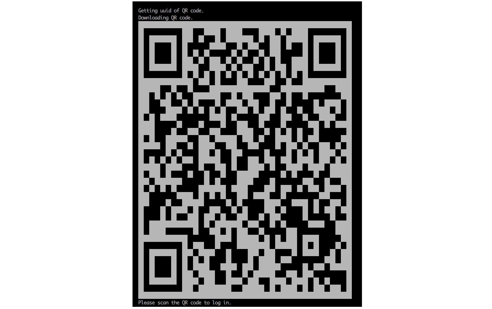

# iWechat 微信机器人
[](https://hub.docker.com/r/iwechat/robot/)
[](https://hub.docker.com/r/iwechat/robot/)
[](https://gitter.im/iWechatBot/community)
[](https://choosealicense.com/licenses/apache-2.0/)


**iWechat微信机器人**实现了wxpy的Docker化，方便使用Docker实现微信机器人的一键启动。同时实现了一下功能：

- 使用图灵机器人回复私聊和群聊中被`@`的信息
- 自动加好友


## 申请图灵机器人接口API_KEY

- 图灵机器人官网: http://www.turingapi.com/


## 启动机器人

### 安装Docker软件

### 运行：


```bash
    docker run -it -e Tuling_API_KEY={图灵机器人API_KEY} iwechat/robot
```

> 请将图灵机器人API_KEY传入docker

### 扫码登录


## 怎样自定义机器人处理代码？

- 新建工作目录，并添加`main.py`，main.py就是自己的自定义处理逻辑的入口文件
- 将工作目录挂载到docker container的`/geekrobot`目录

```bash
docker run -it -v $(pwd):/geekrobot -e Tuling_API_KEY={图灵机器人API_KEY} iwechat/robot
```

### `main.py`示例

```python
import os
from wxpy import *

env_dist = os.environ
bot = Bot(cache_path=True, console_qr=2)
tuling = Tuling(api_key=env_dist.get('Tuling_API_KEY'))


@bot.register(Friend, TEXT)
def reply_my_friend(msg):
  tuling.do_reply(msg)
  print(msg)


embed()
```

## 参考文档

- wxpy: https://wxpy.readthedocs.io
- 图灵机器人官网：http://www.turingapi.com/
- 图灵机器人API文档： https://www.kancloud.cn/turing/www-tuling123-com/718218
